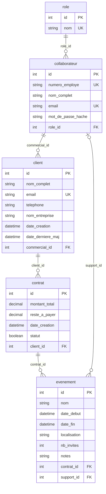

# Schéma de la base de données

Diagramme généré automatiquement à partir des modèles SQLAlchemy
(`python generate_erd.py`). Il reflète donc exactement la base implémentée.

```mermaid
erDiagram
    role ||--o{ collaborateur : "role_id"
    collaborateur ||--o{ client : "commercial_id"
    client ||--o{ contrat : "client_id"
    contrat ||--o{ evenement : "contrat_id"
    collaborateur |o--o{ evenement : "support_id"

    role {
        int id PK
        string nom UK
    }

    collaborateur {
        int id PK
        string numero_employe UK
        string nom_complet
        string email UK
        string mot_de_passe_hache
        int role_id FK
    }

    client {
        int id PK
        string nom_complet
        string email UK
        string telephone
        string nom_entreprise
        datetime date_creation
        datetime date_derniere_maj
        int commercial_id FK
    }

    contrat {
        int id PK
        decimal montant_total
        decimal reste_a_payer
        datetime date_creation
        boolean statut
        int client_id FK
    }

    evenement {
        int id PK
        string nom
        datetime date_debut
        datetime date_fin
        string localisation
        int nb_invites
        string notes
        int contrat_id FK
        int support_id FK
    }
```
