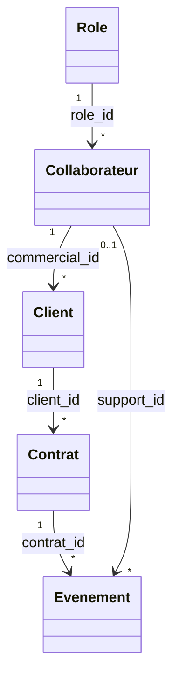
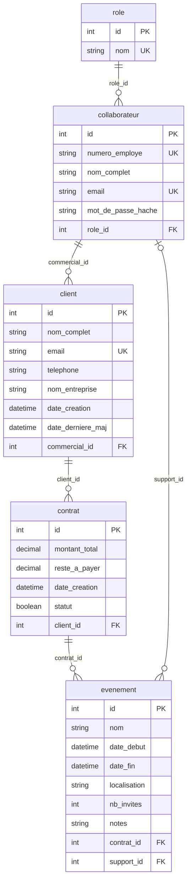

# Schéma de la base de données

Diagrammes générés automatiquement à partir des modèles SQLAlchemy
(`python generate_erd.py`). Ils reflètent donc exactement la base implémentée.

## Vue d'ensemble — cardinalités

## Schéma détaillé — tables, colonnes et contraintes

Notation entité-association : `||` exactement un · `|o` zéro ou un · `o{` plusieurs.
`PK` clé primaire · `FK` clé étrangère · `UK` contrainte d'unicité.

